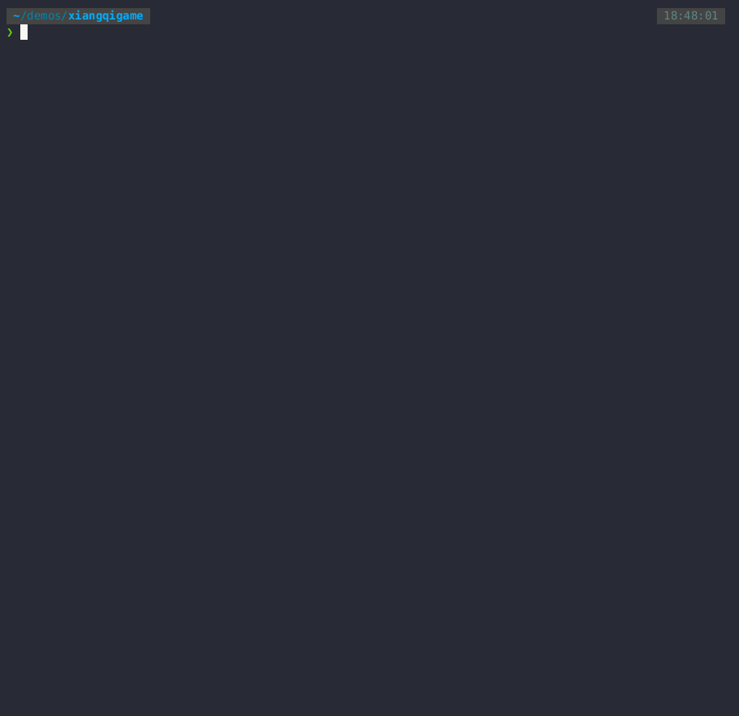

# Running

Once `xiangqigame` has been installed into a Python environment, games can be run using the command `play_xiangqi`.

## The play_xiangqi Command

Information on all available `play_xiangqi` options can be obtained by running `play_xiangqi --help`.


```shell
usage: play_xiangqi [-h] [-rt {person,ai}] [-ra {random,minimax}] [-rst {1,2,3,4,5,6,7,8,9}]
                    [-rk {32,64,128}] [-rn {1,2}] [-rz RED_ZKEYS_SEED] [-bt {person,ai}]
                    [-ba {random,minimax}] [-bst {1,2,3,4,5,6,7,8,9}] [-bk {32,64,128}] [-bn {1,2}]
                    [-bz BLACK_ZKEYS_SEED] [-s] [-d OUTPUT_DIR_SUFFIX]

A Xiangqi (a.k.a. Chinese Chess) game that can be played as Human vs. Human, AI vs. AI, or Human vs. AI

options:
  -h, --help            show this help message and exit
  -rt {person,ai}, --red_player_type {person,ai}
                        Can be 'person', or 'ai'. Default is 'ai'.
  -ra {random,minimax}, --red_algo {random,minimax}
                        Search algorithm to use for red player (if player type is 'ai'). Can be 'random'
                        or 'minimax'. Default is minimax.
  -rst {1,2,3,4,5,6,7,8,9}, --red_strength {1,2,3,4,5,6,7,8,9}
                        Search depth to user for red AI player with minimax algoDefault is 4.
  -rk {32,64,128}, --red_key_size {32,64,128}
                        Key size (in bits) used for red AI player Zobrist hashing
  -rn {1,2}, --red_number_zobrist_states {1,2}
                        Number of Zobrist state values to maintain for red.
  -rz RED_ZKEYS_SEED, --red_zkeys_seed RED_ZKEYS_SEED
                        Seed for red player Zobrist Keys generator. 32-bit unsigned int.
  -bt {person,ai}, --black_player_type {person,ai}
                        Can be 'person', or 'ai'. Default is 'ai'.
  -ba {random,minimax}, --black_algo {random,minimax}
                        Search depth to user for black AI player with minimax algoDefault is 4.
  -bst {1,2,3,4,5,6,7,8,9}, --black_strength {1,2,3,4,5,6,7,8,9}
                        Search depth to user for red player when red is 'ai' with 'minimax.' Default is 4.
  -bk {32,64,128}, --black_key_size {32,64,128}
                        Key size (in bits) used for black AI player Zobrist hashing
  -bn {1,2}, --black_number_zobrist_states {1,2}
                        Number of Zobrist state values to maintain for black.
  -bz BLACK_ZKEYS_SEED, --black_zkeys_seed BLACK_ZKEYS_SEED
                        Seed for black player Zobrist Keys generator. 32-bit unsigned int.
  -s, --save_summary    Save GameSummary as .json
  -d OUTPUT_DIR_SUFFIX, --output_dir_suffix OUTPUT_DIR_SUFFIX
                        String to append to end of output directory name. Output dir relative to cwd will
                        be ./data/game_summaries/<timestamp><optional-suffix>

```

### Terminal Recording of Game with Default Settings

The terminal recording below shows a game run using the command:
```
play_xiangqi -rst 5 -bst 5 -s -d game_01
```


### Additional Example Games

Terminal recordings of games using other seetings are on the [example games page](08_example_games.md)


<div class="section_buttons">
 
| Previous          |                              Next |
|:------------------|----------------------------------:|
| [Installing](02_installing.md) | [Notation](04_notation.md) |
 
</div>