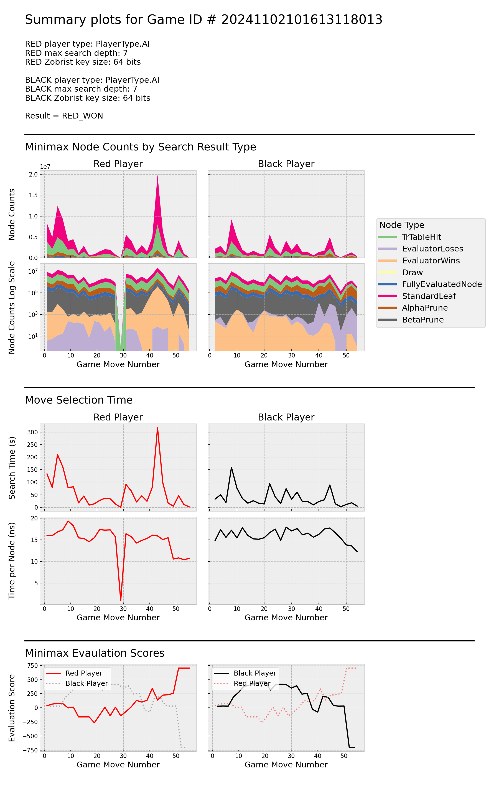

# AI Engine Data

## GameSummary
The return value of xiangqipy.app.run is a xiangqipy.game_summary.GameSummary object containing a variety of data for each move selection performed by any xiangqipy.players.AIPlayer that used a Minimax evaluator during the game.

### Auto-saving Game Summary Data

When  the `-s` or `--save_summary` is passed to the `play_xiangqi` command, the summary object from the ensuing game is serialized and saved in a `.json` file.  The default path of this file is `xiangqigame/data/game_summaries/<game-id>-<suffix>/<game-id>.json` where the `game-id` is auto-generated using a timestamp, and `suffix` is an optional identifier / comment string passed to `play_xiangqi` with the `-d` or `--output_dir_suffix` argument.

### Auto-generating Plots

Using the  `-s` or `--save_summary` option with the `play_xiangqi` command also causes and a standard set of of plots based on parts of the summary object's data to be generated and saved to a `.png` file. An example of these auto-generated plots is shown below.

#### Minimax Node Counts by Search  Result Type
Plots in the "Minimax Node Counts by Search Result" block show the number of nodes evaluated vs. move number, with data grouped or "stacked" by the Minimax termination mode. In these plots, we see that standard leaf nodes (i.e. those where the Minimax algorithm reached its maximum search depth) are most prevalent, followed by transposition table hits. Both players also detected end-of-game nodes throughout the game.

#### Move Selection Time
The "Move Selection Time" section of plots show the total time for move selection as well as the mean evaluation time per node vs move number for each player. We can see that search time for each tracks closely with the number of nodes evaluated. Also, the mean evaluation time per node is ~10 - 20 ns for most moves, with the exception of move #29 where the red player appears to have encountered a transposition table hit for the root node.

#### Minimax Evaluation Scores
The "Minimax Evaluation Scores" plots show the Minimax evaluation score of each move selected during the game. Based on these plots, it appears that the black player held a moderate advantage during the middle portion of the game, but red established the stronger position during the final ~10 moves and ultimately won the game. 

#### Data from Additional Games

Additional examples of auto-generated game summary plots are on the [example games page](08_example_games.md)

### Additional / Custom Analysis of GameSummary Data
The data in a xiangqipy.game_summary.GameSummary contains information beyond that shown in the default auto-generated plots, and can be used to gain further understanding of the inner-workings of our AI engine. Summary data stored in `.json` form can be re-imported to Python using xiangqipy.game_summary_io.import_game_summary, as is done for the analyses performed by several modules in `tests/python`.

| Previous          |                              Next |
|:------------------|----------------------------------:|
| [Minimax Details](06_minimax_details.md) |  [Example Games](08_example_games.md)|

