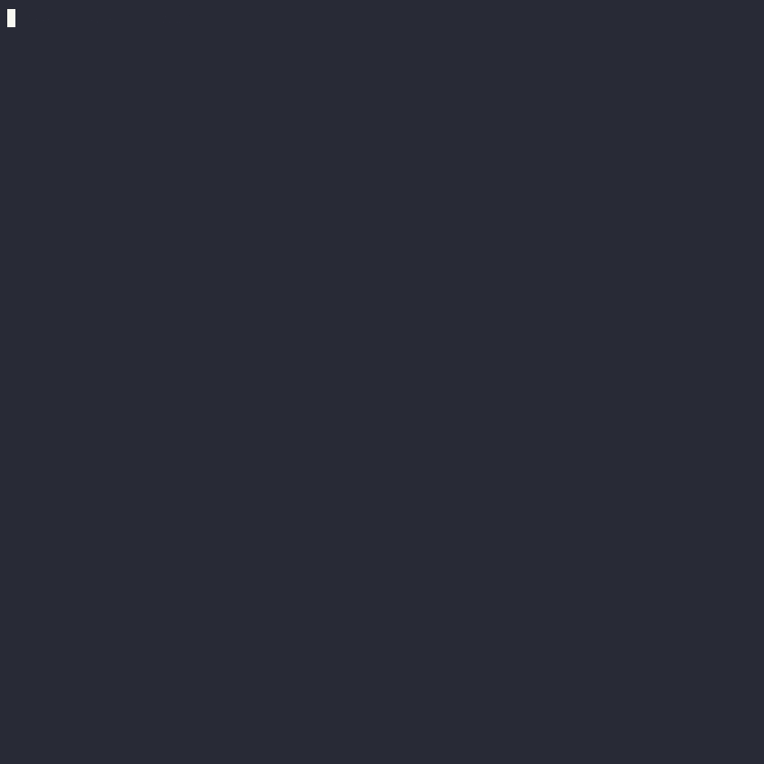

## Overview

This project consists of a C++ AI engine for the board game [Xiangqi](https://en.wikipedia.org/wiki/Xiangqi) (a.k.a. Chinese chess). An outer Ptyhon layer manages games, provides a commmand line interface, plots data generated by the core engine and allows the project to be installed with pip. AI vs AI, AI vs Human, and Human vs Human game modes are supported.

## Getting Started

Xiangqigame can be installed natively (preferably in a virtual environment or conda environment), or in a Docker container.

### Native installation

- Requirements
    - A C++ compiler that supports the C++ 20 standard
    - cmake 3.21+
    - Python 3.10+
    - Anaconda or Miniconda (recommended)

- Procedure
    ```
    git clone https://github.com/duanegoodner/xiangqigame
    cd xiangqigame
    conda create --name xiangqigame python=3.10 -y
    conda activate xiangqigame
    pip install .
    ```

### Docker installation

- Requirements
    - Docker 18.06+
    - Docker Compose 1.25.0+

- Procedure

    ```shell
    git clone https://github.com/duanegoodner/xiangqigame
    cd xiangqigame/.devcontainer
    docker compose build
    docker compose up -d
    docker exec -it cpyenv /bin/zsh  # This command will take you to a prompt inside container 'cpyenv'
    pip install .
    ```
- Exiting and stopping the Docker container

    When you want to stop the container, run `docker compose down` from the `.devcontainer/` directory (outside of the Docker container).

### Running Xiangqigame
The command line interface is accessed using the `play_xiangqi` command.

`play_xiangqi --help` provides information of various options.

Running this command without any additional arguments will start an AI vs AI game with both players using a Minimax search depth of 4, and 64 bit keys in their Zobrist hash tables.

### Demo
The following gif recording demonstrates the procedure for native installation, and then runs several AI vs AI games using the `play_xiangqi` command. The first game uses default settings. For subsequent games, command line arguments are used to adjust players' minimax search depths, and save gaame data/plots to .json and .png files.




### Python Integration

### Installing and playing Xiangqigame

- This project consists of a C++ AI engine for the board game Xiangqi
- Pybind11 module exposes functions to Ptyhon
- Package can be installed into a Python environmnet via pip
- 


### Game Analysis and Reporting

#### Installing and running in a containerized environment


```

```


## Description

* Can be played by human and/or AI player
* Game management and user interface implemented in Python
* Piece move calcluations and minimax search algorithm (used by AI player) implemented in C++ and exposed to Python using [pybind11](https://github.com/pybind/pybind11)
