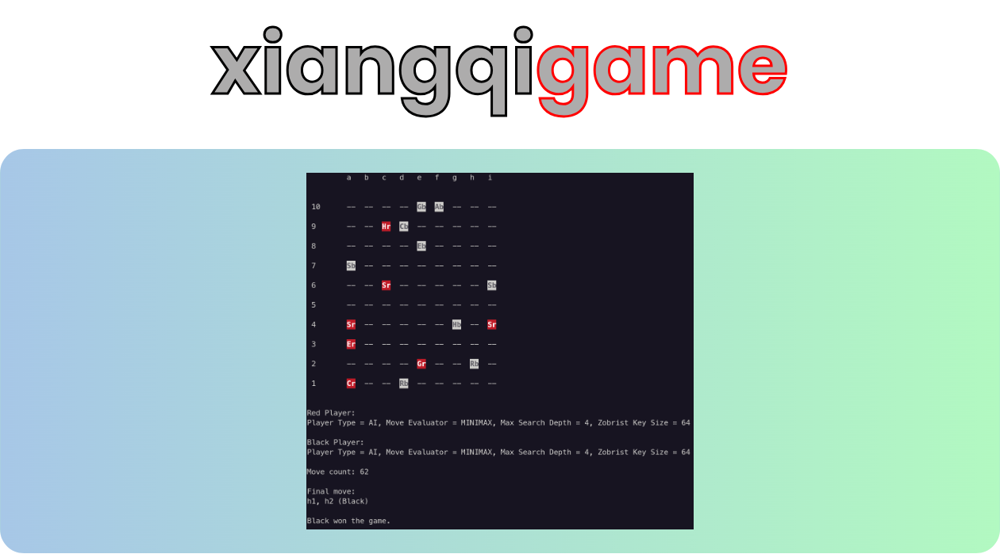

## Overview

This project consists of a C++ Artificial Intelligence (AI) engine for the board game [Xiangqi](https://en.wikipedia.org/wiki/Xiangqi) (also known as Chinese chess). The AI utilizes the Minimax algorithm enhanced by Alpha-Beta pruning to select moves. A points value for each encountered game state is calculated based of the type and position of each piece present on the board. These pionts values are stored in a Zobrist hashing-based transposition table to prevent repeating calculations of a previously seen board state.

The C++ core of the engine is integrated with an outer Python layer using Pybind11, facilitating installation as a standard Python package via [pip](https://pip.pypa.io/en/stable/). The Python layer provides a command-line interface (CLI) that supports multiple game modes: AI vs. AI, AI vs. Human, and Human vs. Human. Additionally, the CLI offers configurable settings for the Minimax search depth and Zobrist key size. It also allows users to access detailed data about the internal workings of the search algorithm generated during games.

## Getting Started

Xiangqigame can be installed natively (preferably in a virtual environment or conda environment), or in a Docker container.

### Native installation

- Requirements
    - A C++ compiler that supports the C++ 20 standard
    - cmake 3.21+
    - Python 3.10+
    - Anaconda or Miniconda (recommended)

- Procedure
    ```
    git clone https://github.com/duanegoodner/xiangqigame
    cd xiangqigame
    conda create --name xiangqigame python=3.10 -y
    conda activate xiangqigame
    pip install .
    ```

### Docker installation

- Requirements
    - Docker 18.06+
    - Docker Compose 1.25.0+

- Procedure

    ```shell
    git clone https://github.com/duanegoodner/xiangqigame
    cd xiangqigame/.devcontainer
    docker compose build
    docker compose up -d
    docker exec -it cpyenv /bin/zsh  # This command will take you to a prompt inside container 'cpyenv'
    pip install .
    ```
- Exiting and stopping the Docker container

    When you want to stop the container, run `docker compose down` from the `.devcontainer/` directory (outside of the Docker container).

### Running Xiangqigame
The command line interface is accessed using the `play_xiangqi` command.

`play_xiangqi --help` provides information of various options.

## Documentation

For more details, see the project documentation at https://duanegoodner.github.io/xiangqigame/


