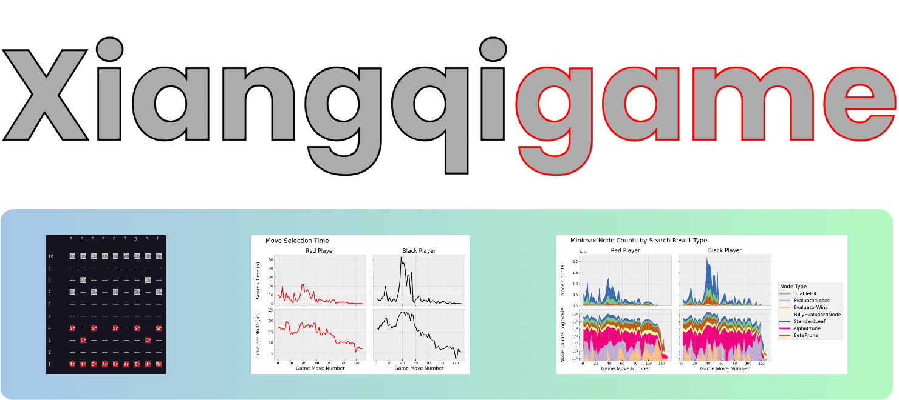

## Overview

This project consists of a C++ Artificial Intelligence (AI) engine for the board game [Xiangqi](https://en.wikipedia.org/wiki/Xiangqi) (also known as Chinese chess)  and supports playing games in AI vs. AI, AI vs. Human, and Human vs. Human modes. The AI utilizes the Minimax algorithm enhanced by Alpha-Beta pruning to select moves. A transposition table based on Zobrist hashing is implemented for storage / retrieval of board state evaulation results and prevents re-calculation of previously seen board states.

The C++ core of the engine is integrated with an outer Python layer using [Pybind11](https://github.com/pybind/pybind11). The Python layer provides a command-line interface (CLI) for running games and setting engine parameters, displays a text-based game board, and saves detailed data generated by the core engine during move selection. [Scikit-build-core](https://github.com/scikit-build/scikit-build-core) is used to connect the to the C++ CMake build system with [pip](https://pip.pypa.io/en/stable/), facilitating installation as a standard Python package.


## Getting Started

Xiangqigame can be installed natively (preferably in a virtual environment or conda environment), or in a Docker container.

### Native installation

#### Requirements
- A C++ compiler that supports the C++ 20 standard
- cmake 3.21+
- Python 3.10+
- Anaconda or Miniconda (recommended)

#### Procedure
```
git clone https://github.com/duanegoodner/xiangqigame
cd xiangqigame
conda create --name xiangqigame python=3.10 -y
conda activate xiangqigame
pip install .
```

### Docker installation

#### Requirements
- Docker 18.06+
- Docker Compose 1.25.0+

#### Procedure
```shell
git clone https://github.com/duanegoodner/xiangqigame
cd xiangqigame/.devcontainer
docker compose build
docker compose up -d
docker exec -it cpyenv /bin/zsh  # This command will take you to a prompt inside container 'cpyenv'
pip install .
```
#### Stopping the Docker container

Running `docker compose down` from the `.devcontainer/` directory at a local command prompt (outside of the Docker container) will stop the container.

### Running Xiangqigame

An AI vs. AI game with default engine settings can be started by running :
```
play_xiangqi
```

Running `play_xiangqi --help` provides information on the the arguments that can be passed to customize game settings.

## Documentation

Full project documentation is available at [duanegoodner.github.io/xiangqigame/](https://duanegoodner.github.io/xiangqigame/).


