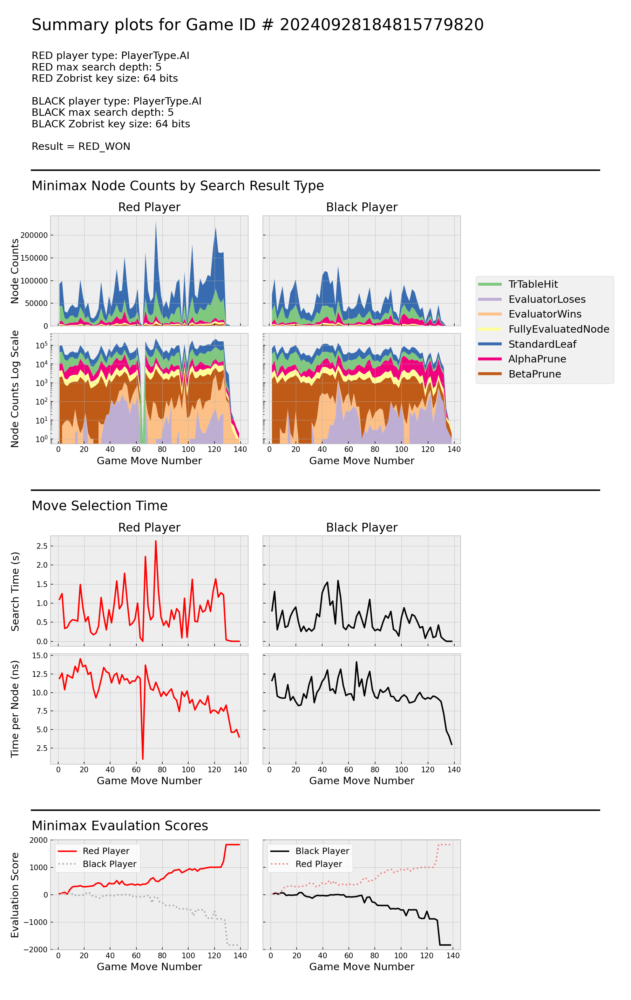
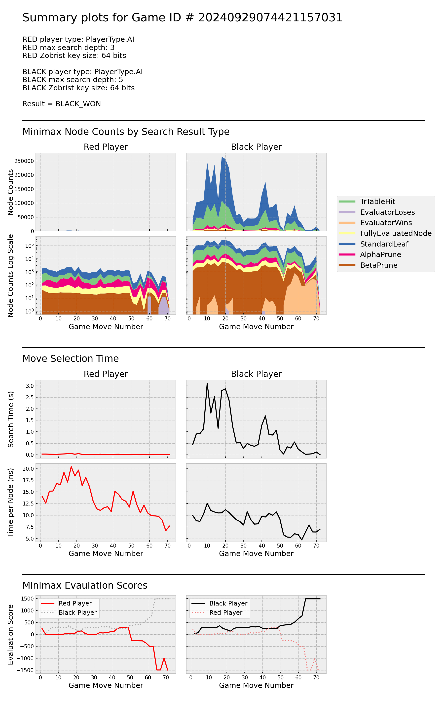
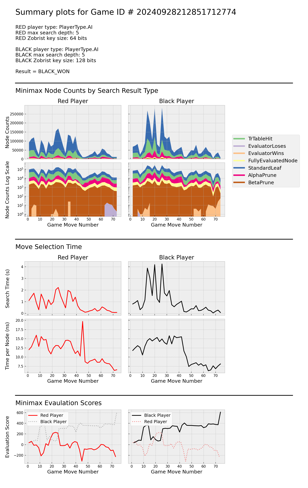

# Running

Once `xiangqigame` has been installed into a Python environment, games can be run using the command `play_xiangqi`.

## The play_xiangqi Command

Information on all available `play_xiangqi` options can be obtained by running `play_xiangqi --help`.


```shell
usage: play_xiangqi [-h] [-rt {person,ai}] [-ra {random,minimax}] [-rst {1,2,3,4,5,6,7,8,9}]
                    [-rk {32,64,128}] [-rn {1,2}] [-rz RED_ZKEYS_SEED] [-bt {person,ai}]
                    [-ba {random,minimax}] [-bst {1,2,3,4,5,6,7,8,9}] [-bk {32,64,128}] [-bn {1,2}]
                    [-bz BLACK_ZKEYS_SEED] [-s] [-d OUTPUT_DIR_SUFFIX]

A Xiangqi (a.k.a. Chinese Chess) game that can be played as Human vs. Human, AI vs. AI, or Human vs. AI

options:
  -h, --help            show this help message and exit
  -rt {person,ai}, --red_player_type {person,ai}
                        Can be 'person', or 'ai'. Default is 'ai'.
  -ra {random,minimax}, --red_algo {random,minimax}
                        Search algorithm to use for red player (if player type is 'ai'). Can be 'random'
                        or 'minimax'. Default is minimax.
  -rst {1,2,3,4,5,6,7,8,9}, --red_strength {1,2,3,4,5,6,7,8,9}
                        Search depth to user for red AI player with minimax algoDefault is 4.
  -rk {32,64,128}, --red_key_size {32,64,128}
                        Key size (in bits) used for red AI player Zobrist hashing
  -rn {1,2}, --red_number_zobrist_states {1,2}
                        Number of Zobrist state values to maintain for red.
  -rz RED_ZKEYS_SEED, --red_zkeys_seed RED_ZKEYS_SEED
                        Seed for red player Zobrist Keys generator. 32-bit unsigned int.
  -bt {person,ai}, --black_player_type {person,ai}
                        Can be 'person', or 'ai'. Default is 'ai'.
  -ba {random,minimax}, --black_algo {random,minimax}
                        Search depth to user for black AI player with minimax algoDefault is 4.
  -bst {1,2,3,4,5,6,7,8,9}, --black_strength {1,2,3,4,5,6,7,8,9}
                        Search depth to user for red player when red is 'ai' with 'minimax.' Default is 4.
  -bk {32,64,128}, --black_key_size {32,64,128}
                        Key size (in bits) used for black AI player Zobrist hashing
  -bn {1,2}, --black_number_zobrist_states {1,2}
                        Number of Zobrist state values to maintain for black.
  -bz BLACK_ZKEYS_SEED, --black_zkeys_seed BLACK_ZKEYS_SEED
                        Seed for black player Zobrist Keys generator. 32-bit unsigned int.
  -s, --save_summary    Save GameSummary as .json
  -d OUTPUT_DIR_SUFFIX, --output_dir_suffix OUTPUT_DIR_SUFFIX
                        String to append to end of output directory name. Output dir relative to cwd will
                        be ./data/game_summaries/<timestamp><optional-suffix>

```

## Example Games

This section shows terminal recordings and Minimax data plots for games run with a variety of `play_xiangqi` command options. 


### Game #1:

#### Settings

- Red: Search depth = 5, Zobrist key size = 64 bits


```
play_xiangqi -rst 5 -bst 5 -s -d game_01
```
#### Terminal Recording


#### Minimax Data


#### Synopsis
Red establishes an advantage early, and maintains it throughout the game. During searches for moves ~ 40 - 60, both players detect ~100 leaf nodes with Red losing, but Red is able to prevent actual game moves from going down these paths. Around move 65, Red discovers a transposition table hit in the root node, resulting very low search time. Red's search time per node trends downward throughout the game as its ratio of transposition table hits to standard leaves increases. Search time per node for both players drops sharply in the final ~10 moves, likely due to discovery of shallow end-of-game leaves.

### Game #2:

```
play_xiangqi -rst 5 -bst 3 -s -d game_02
```

#### Terminal Recording


#### Minimax Data


#### Synopsis
With the the deeper search depth, Red explores ~100x more nodes per move than Black throughout most of the game. Red's search time per node drops significantly from moves 40 - 60, largely due an increase in the ratio of transposition table hits to standard leaves. Black's search time per node also decreases in the same move range, benefitting from significant alpha pruning. Red realizes that its victory is guaranteed around move 85. Black does not realize that its loss is inevitable until move ~102.

### Game #3:

```
play_xiangqi -rst 3 -bst 5 -s -d game_03
```
#### Terminal Recording


#### Minimax Data


#### Synopsis

Now, with Black using the deeper search depth, it searches ~100x more nodes per move than red. Both players exhibit a downward trend in search time per node throughout the game as pruning and transposition table hits become more significant (relative to standard leaves and fully evaluated nodes). Black detects that its victory is nearly certain around move 63. 

### Game #4:

```
play_xiangqi -ra random -bst 5 -s -d game_04
```
#### Terminal Recording


#### Minimax Data


#### Synopsis
In this game Red randomly selects one of its available moves on each turn, so Minimax data are only generated for Black. Black detects a path to victory at move 40, although the game continues for another 30 moves after this point. This larger than usual number of moves between victory detection and end-of-game is likely due to Red's random decisions which do not match the assumptions of Black's Minimax algorithm. Black's number of nodes explored per move drops dramatically at the same time that it realizes victory is virtually assured due to the discovery of end of game nodes.

### Game #5:

```
play_xiangqi -rst 6 -bst 6 -s -d game_05
```
#### Terminal Recording


#### Minimax Data


#### Synopsis

In this game, both players use a max search depth = 6, which is larger than the search depths used in any other games in our demo series. During early moves, max search times per move are ~2x higher than observed for players with search depth = 5. Black has the advantage until move 80, but Red then quickly gains the upper hand and ultimately wins at move 136. Both players become aware of the eventual result around move 124.

### Game #6

```
play_xiangqi -rst 5 -bst 5 -bk 128 -s -d game_06
```
#### Terminal Recording


#### Minimax Data



#### Synopsis

Here, Red and Black use the same search depth (= 5), but black uses 128 bit Zobrist hashing keys instead of the usual 64 bits. While the use of 128 bit keys drastically reduces the hash collision probability, the time per node data do not indicate any significant search time penalty for the larger key size.

Deeper investigation into Minimax game data shows that with 64 bit keys and search depth = 5, evidence of one or more hash collisions is found in approximately 1 out of 6 games. It is likely that the actual rate of collisions is more common than this, as a collison is only detected if it causes a player to attempt an illegal move - and not all collisions will result in selection of an illegal move. With 128 bit keys, the practical hash probability goes to zero. Although the player with the larger key size does win the game here, it is not yet clear if 128 bit keys produce a significant benefit over 64 bit keys in game outcome. 


### Game #7

```
play_xiangqi -rt person -bst 4 -s -d game_07
```
#### Terminal Recording


#### Minimax Data


#### Synopsis


<div class="section_buttons">
 
| Previous          |                              Next |
|:------------------|----------------------------------:|
| [Installing](02_installing.md) | [Notation](04_notation.md) |
 
</div>