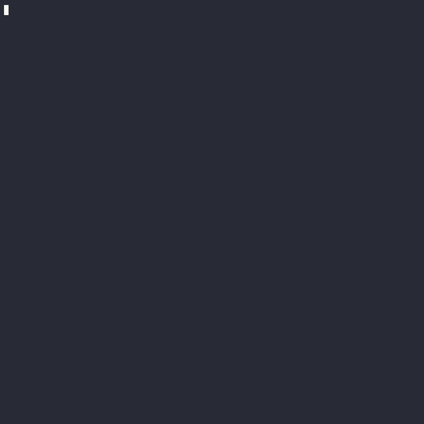

# Terminal Recording Demo
The following gif recording demonstrates the procedure for native installation, and then runs several AI vs AI games using the `play_xiangqi` command. The first game uses default settings. For subsequent games, command line arguments are used to adjust players' minimax search depths, and save gaame data/plots to .json and .png files.

