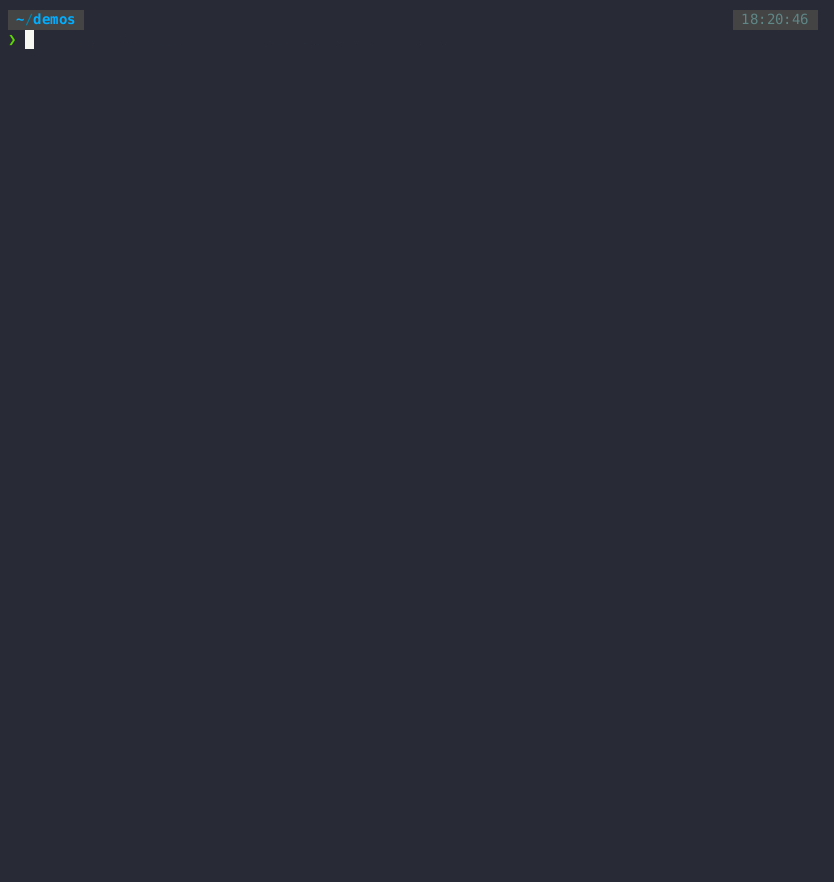

# Installing Xiangqigame

Xiangqigame can be installed natively (preferably in a virtual environment or conda environment), or in a Docker container. Terminal recordings of each installation option are show in the Demos section:


## Native Installation

### Requirements

- A C++ compiler that supports the C++ 20 standard
- cmake 3.21+
- Python 3.10+
- Anaconda or Miniconda (recommended)

### Procedure
    
```
git clone https://github.com/duanegoodner/xiangqigame
cd xiangqigame
conda create --name xiangqigame python=3.10 -y
conda activate xiangqigame
pip install .
```

### Demo



## Docker Installation

### Requirements

- Docker 18.06+
- Docker Compose 1.25.0+

### Procedure

For initial Docker set up and installation, run the following:

```shell
git clone https://github.com/duanegoodner/xiangqigame
cd xiangqigame/.devcontainer
docker compose build
docker compose up -d
docker exec -it cpyenv /bin/zsh  # This command will take you to a prompt inside container 'cpyenv'
pip install .
```
### Stopping the Docker Container

When you are done using the `cpyenv` container, run `docker compose down` at a local terminal (i.e. outside of the container) while in the `xiangqigame/.devcontainer` directory.

### Re-Starting the Docker Container

To re-start the container, run the following from the `xiangqigame/.devcontainer` directory:

```shell
docker compose build  # not necessary if cpyenv exists, but will execute very fast in that case 
docker compose up -d
docker exec -it cpyenv /bin/zsh  # This command will take you to a prompt inside container 'cpyenv'
pip install .
```

### Demo


